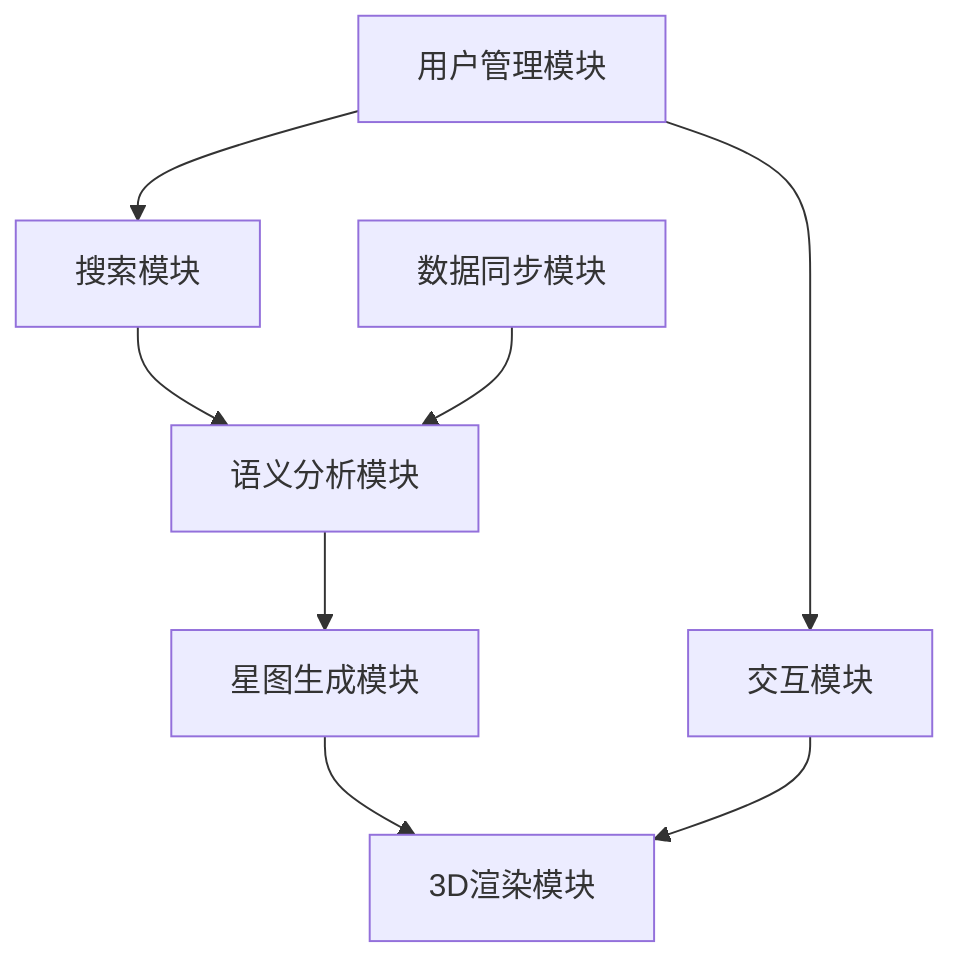
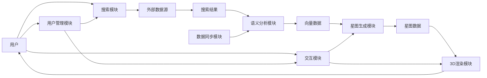

# SeekStar 核心功能模块和数据结构设计

## 1. 核心功能模块设计

### 1.1 搜索模块

#### 1.1.1 功能描述
搜索模块是SeekStar的入口，负责接收用户搜索请求，整合多种数据源，并返回初步的搜索结果。

#### 1.1.2 子模块

| 子模块 | 功能 |
|-------|------|
| 查询处理 | 解析用户搜索词，进行分词和语义扩展 |
| 数据源整合 | 调用外部搜索引擎API和内部知识库 |
| 结果过滤 | 去重、过滤低质量内容 |
| 结果排序 | 基于相关性和质量进行初步排序 |

#### 1.1.3 工作流程
```
用户输入 → 查询处理 → 多数据源请求 → 结果聚合 → 结果过滤 → 结果排序 → 返回初步结果
```

### 1.2 语义分析模块

#### 1.2.1 功能描述
语义分析模块负责将文本内容转换为向量表示，为后续的星图生成提供基础。

#### 1.2.2 子模块

| 子模块 | 功能 |
|-------|------|
| 文本处理 | 清洗、预处理文本内容 |
| 向量生成 | 使用预训练模型生成文本嵌入 |
| 语义相似度计算 | 计算内容之间的语义关联强度 |
| 主题提取 | 自动识别内容的主题标签 |

#### 1.2.3 工作流程
```
文本输入 → 文本处理 → 向量生成 → 语义相似度计算 → 主题提取 → 返回向量数据
```

### 1.3 星图生成模块

#### 1.3.1 功能描述
星图生成模块是SeekStar的核心，负责将向量数据转换为可视化的3D星图。

#### 1.3.2 子模块

| 子模块 | 功能 |
|-------|------|
| 降维处理 | 将高维向量转换为3D坐标 |
| 聚类分析 | 识别相似星点，形成星团 |
| 布局优化 | 调整星点位置，生成美观的星图布局 |
| 星团命名 | 为星团自动生成主题名称 |

#### 1.3.3 工作流程
```
向量数据 → 降维处理 → 3D坐标生成 → 聚类分析 → 星团生成 → 布局优化 → 星团命名 → 星图数据组装
```

### 1.4 3D渲染模块

#### 1.4.1 功能描述
3D渲染模块负责将星图数据渲染为用户可交互的3D场景。

#### 1.4.2 子模块

| 子模块 | 功能 |
|-------|------|
| 场景管理 | 创建和管理3D场景 |
| 星点渲染 | 高效渲染大量星点 |
| 星团渲染 | 渲染星团边界和标签 |
| 连线渲染 | 渲染星点之间的关联连线 |
| 光照与材质 | 管理场景的光照和材质效果 |

#### 1.4.3 工作流程
```
星图数据 → 场景初始化 → 星点渲染 → 星团渲染 → 连线渲染 → 光照设置 → 场景优化 → 实时渲染
```

### 1.5 交互模块

#### 1.5.1 功能描述
交互模块负责处理用户输入，实现星图的各种交互操作。

#### 1.5.2 子模块

| 子模块 | 功能 |
|-------|------|
| 输入处理 | 接收和解析用户输入（鼠标、触摸、键盘） |
| 镜头控制 | 实现星图的旋转、缩放、平移 |
| 飞行系统 | 实现平滑的镜头飞行效果 |
| 选择系统 | 处理星点和星团的选择 |
| 信息展示 | 展示选中对象的详细信息 |

#### 1.5.3 工作流程
```
用户输入 → 输入处理 → 镜头控制/飞行系统/选择系统 → 场景更新 → 信息展示 → 渲染更新
```

### 1.6 数据同步模块

#### 1.6.1 功能描述
数据同步模块负责定期从外部数据源获取新内容，更新内部知识库。

#### 1.6.2 子模块

| 子模块 | 功能 |
|-------|------|
| 爬虫系统 | 从网页和API获取新内容 |
| 数据清洗 | 清理和标准化爬取的数据 |
| 数据索引 | 将新数据添加到向量数据库和图数据库 |
| 更新通知 | 通知相关模块数据已更新 |

#### 1.6.3 工作流程
```
定时触发 → 爬虫系统运行 → 数据爬取 → 数据清洗 → 语义分析 → 数据索引 → 更新通知
```

### 1.7 用户管理模块

#### 1.7.1 功能描述
用户管理模块负责处理用户认证、授权和个性化设置。

#### 1.7.2 子模块

| 子模块 | 功能 |
|-------|------|
| 认证授权 | 处理用户注册、登录、权限管理 |
| 个性化设置 | 存储和管理用户偏好 |
| 历史记录 | 记录用户的搜索和浏览历史 |
| 收藏管理 | 管理用户收藏的星点和星团 |

## 2. 核心数据结构设计

### 2.1 星点（StarPoint）数据结构

星点是SeekStar中最基本的数据单元，代表一个信息节点。

```typescript
interface StarPoint {
  // 基本信息
  id: string;               // 唯一标识符
  title: string;            // 标题
  url: string;              // 原始URL
  source: string;           // 数据源（如Google、Bing等）
  content: string;          // 摘要内容
  publishDate: Date;        // 发布日期
  
  // 元数据
  author: string[];         // 作者
  tags: string[];           // 标签
  language: string;         // 语言
  contentType: string;      // 内容类型（网页、博客、论文等）
  
  // 向量信息
  vector: number[];         // 高维向量表示
  
  // 3D坐标
  position: {
    x: number;              // X坐标
    y: number;              // Y坐标
    z: number;              // Z坐标
  };
  
  // 视觉属性
  size: number;             // 大小（基于质量和相关性）
  brightness: number;       // 亮度（基于质量和相关性）
  color: string;            // 颜色（基于主题或来源）
  
  // 关联信息
  clusterId: string | null; // 所属星团ID
  relatedStars: {
    id: string;            // 相关星点ID
    weight: number;        // 关联强度（0-1）
  }[];
  
  // 统计信息
  viewCount: number;        // 被查看次数
  clickCount: number;       // 被点击次数
  relevanceScore: number;   // 相关性分数
  qualityScore: number;     // 质量分数
}
```

### 2.2 星团（StarCluster）数据结构

星团是由相似星点组成的集合，代表一个主题或领域。

```typescript
interface StarCluster {
  id: string;               // 唯一标识符
  name: string;             // 星团名称（自动生成或用户自定义）
  description: string;      // 星团描述
  
  // 3D属性
  position: {
    x: number;              // 中心X坐标
    y: number;              // 中心Y坐标
    z: number;              // 中心Z坐标
  };
  radius: number;           // 星团半径
  
  // 视觉属性
  color: string;            // 星团主题颜色
  opacity: number;          // 透明度
  
  // 成员信息
  starIds: string[];        // 包含的星点ID列表
  starCount: number;        // 星点数量
  
  // 元数据
  tags: string[];           // 主题标签
  mainTopic: string;        // 主要主题
  subTopics: string[];      // 子主题
  
  // 创作者信息
  topAuthors: {
    id: string;            // 作者ID
    name: string;          // 作者名称
    starCount: number;     // 该作者在星团中的星点数量
    contributionScore: number; // 贡献度分数
  }[];                     // 星团中贡献度最高的作者列表
  
  // 关联信息
  relatedClusters: {
    id: string;            // 相关星团ID
    weight: number;        // 关联强度
  }[];
  
  // 统计信息
  relevanceScore: number;   // 相关性分数
  qualityScore: number;     // 质量分数
}
```

### 2.3 星图（StarMap）数据结构

星图是星点和星团的集合，代表一次搜索或浏览的完整场景。

```typescript
interface StarMap {
  id: string;               // 唯一标识符
  
  // 基本信息
  name: string;             // 星图名称
  description: string;      // 星图描述
  createdAt: Date;          // 创建时间
  updatedAt: Date;          // 更新时间
  
  // 内容信息
  stars: StarPoint[];       // 星点列表
  clusters: StarCluster[];  // 星团列表
  
  // 创作者信息
  authors: {
    id: string;            // 作者ID
    name: string;          // 作者名称
    starCount: number;     // 该作者在星图中的星点数量
    clusters: string[];    // 该作者参与的星团ID列表
  }[];                     // 星图中所有作者的信息
  
  // 视图信息
  cameraPosition: {
    x: number;
    y: number;
    z: number;
  };                       // 初始相机位置
  cameraTarget: {
    x: number;
    y: number;
    z: number;
  };                       // 初始相机目标
  
  // 元数据
  searchQuery: string;      // 关联的搜索词
  tags: string[];           // 星图标签
  
  // 统计信息
  totalStars: number;       // 星点总数
  totalClusters: number;    // 星团总数
  totalAuthors: number;     // 作者总数
}
```

### 2.4 搜索结果（SearchResult）数据结构

搜索结果是搜索模块返回的初步结果，用于后续的语义分析和星图生成。

```typescript
interface SearchResult {
  id: string;               // 唯一标识符
  
  // 基本信息
  title: string;            // 标题
  url: string;              // 原始URL
  source: string;           // 数据源
  content: string;          // 摘要内容
  
  // 元数据
  author: string[];         // 作者
  publishDate: Date;        // 发布日期
  language: string;         // 语言
  contentType: string;      // 内容类型
  
  // 搜索相关信息
  searchQuery: string;      // 搜索词
  rank: number;             // 原始排名
  relevanceScore: number;   // 相关性分数
  
  // 处理状态
  isProcessed: boolean;     // 是否已进行语义分析
  processingError?: string; // 处理错误信息
}
```

### 2.5 用户（User）数据结构

用户数据结构用于存储用户信息和个性化设置。

```typescript
interface User {
  id: string;               // 唯一标识符
  
  // 基本信息
  username: string;         // 用户名
  email: string;            // 邮箱
  avatar?: string;          // 头像URL
  createdAt: Date;          // 注册时间
  
  // 认证信息
  passwordHash: string;     // 密码哈希
  salt: string;             // 密码盐值
  
  // 个性化设置
  preferences: {
    theme: 'light' | 'dark' | 'auto'; // 主题
    defaultView: '3d' | '2d';        // 默认视图
    starDensity: number;             // 星点密度
    showLabels: boolean;             // 是否显示标签
    autoFly: boolean;                // 是否自动飞行
  };
  
  // 历史记录
  searchHistory: {
    query: string;          // 搜索词
    timestamp: Date;        // 搜索时间
    starMapId?: string;     // 关联的星图ID
  }[];
  
  // 收藏
  favorites: {
    type: 'star' | 'cluster' | 'map'; // 收藏类型
    targetId: string;                 // 目标ID
    timestamp: Date;                  // 收藏时间
  }[];
  
  // 权限
  role: 'user' | 'admin';   // 用户角色
  permissions: string[];    // 具体权限列表
}
```

### 2.6 向量数据（VectorData）结构

向量数据结构用于存储文本的高维向量表示。

```typescript
interface VectorData {
  id: string;               // 唯一标识符
  
  // 向量信息
  vector: number[];         // 高维向量
  dimension: number;        // 向量维度
  modelName: string;        // 生成向量的模型名称
  
  // 关联信息
  targetId: string;         // 关联的内容ID（如StarPoint.id）
  targetType: string;       // 关联的内容类型
  
  // 元数据
  createdAt: Date;          // 创建时间
  updatedAt: Date;          // 更新时间
}
```

## 3. 数据库设计

### 3.1 关系数据库表结构

#### 3.1.1 users 表

| 字段名 | 数据类型 | 约束 | 描述 |
|-------|---------|------|------|
| id | UUID | PRIMARY KEY | 用户ID |
| username | VARCHAR(255) | UNIQUE NOT NULL | 用户名 |
| email | VARCHAR(255) | UNIQUE NOT NULL | 邮箱 |
| password_hash | VARCHAR(255) | NOT NULL | 密码哈希 |
| salt | VARCHAR(255) | NOT NULL | 密码盐值 |
| avatar | VARCHAR(512) | | 头像URL |
| role | VARCHAR(50) | NOT NULL DEFAULT 'user' | 用户角色 |
| created_at | TIMESTAMP | NOT NULL DEFAULT CURRENT_TIMESTAMP | 注册时间 |
| updated_at | TIMESTAMP | NOT NULL DEFAULT CURRENT_TIMESTAMP ON UPDATE CURRENT_TIMESTAMP | 更新时间 |

#### 3.1.2 search_history 表

| 字段名 | 数据类型 | 约束 | 描述 |
|-------|---------|------|------|
| id | UUID | PRIMARY KEY | 历史记录ID |
| user_id | UUID | FOREIGN KEY REFERENCES users(id) | 用户ID |
| query | TEXT | NOT NULL | 搜索词 |
| star_map_id | UUID | | 关联的星图ID |
| created_at | TIMESTAMP | NOT NULL DEFAULT CURRENT_TIMESTAMP | 搜索时间 |

#### 3.1.3 favorites 表

| 字段名 | 数据类型 | 约束 | 描述 |
|-------|---------|------|------|
| id | UUID | PRIMARY KEY | 收藏ID |
| user_id | UUID | FOREIGN KEY REFERENCES users(id) | 用户ID |
| target_type | VARCHAR(50) | NOT NULL | 收藏类型 |
| target_id | UUID | NOT NULL | 目标ID |
| created_at | TIMESTAMP | NOT NULL DEFAULT CURRENT_TIMESTAMP | 收藏时间 |

### 3.2 图数据库节点和关系

#### 3.2.1 节点类型

| 节点类型 | 属性 |
|---------|------|
| StarPoint | id, title, url, content |
| StarCluster | id, name, description |
| Author | id, name |
| Topic | id, name |

#### 3.2.2 关系类型

| 关系类型 | 起始节点 | 终止节点 | 属性 |
|---------|---------|---------|------|
| BELONGS_TO | StarPoint | StarCluster | weight |
| WRITTEN_BY | StarPoint | Author | |
| HAS_TOPIC | StarPoint | Topic | weight |
| RELATED_TO | StarPoint | StarPoint | weight |
| RELATED_TO | StarCluster | StarCluster | weight |
| SIMILAR_TO | Topic | Topic | weight |

### 3.3 向量数据库结构

向量数据库用于存储和检索高维向量，支持快速的相似度查询。

| 索引名 | 向量维度 | 距离度量 | 描述 |
|-------|---------|---------|------|
| starpoint_vectors | 768 | cosine | 星点向量索引 |
| cluster_vectors | 768 | cosine | 星团向量索引 |
| topic_vectors | 768 | cosine | 主题向量索引 |

## 4. API 数据传输对象（DTOs）

### 4.1 搜索请求 DTO

```typescript
interface SearchRequestDto {
  query: string;            // 搜索词
  limit?: number;           // 结果数量限制
  sources?: string[];       // 数据源过滤
  languages?: string[];     // 语言过滤
  contentTypes?: string[];  // 内容类型过滤
}
```

### 4.2 星图响应 DTO

```typescript
interface StarMapResponseDto {
  id: string;
  name: string;
  description?: string;
  stars: StarPointDto[];
  clusters: StarClusterDto[];
  cameraPosition: {
    x: number;
    y: number;
    z: number;
  };
  cameraTarget: {
    x: number;
    y: number;
    z: number;
  };
  totalStars: number;
  totalClusters: number;
  createdAt: Date;
}
```

### 4.3 星点 DTO

```typescript
interface StarPointDto {
  id: string;
  title: string;
  url: string;
  source: string;
  content: string;
  author: string[];
  tags: string[];
  publishDate: Date;
  position: {
    x: number;
    y: number;
    z: number;
  };
  size: number;
  brightness: number;
  color: string;
  clusterId?: string;
  relevanceScore: number;
}
```

### 4.4 星团 DTO

```typescript
interface StarClusterDto {
  id: string;
  name: string;
  description?: string;
  position: {
    x: number;
    y: number;
    z: number;
  };
  radius: number;
  color: string;
  opacity: number;
  starCount: number;
  tags: string[];
  mainTopic: string;
  relevanceScore: number;
}
```

## 5. 模块间依赖关系



## 6. 数据流向



---

# 版本历史

| 版本 | 日期 | 作者 | 说明 |
|------|------|------|------|
| v1.0 | 2025-12-29 | SeekStar Team | 初始核心模块和数据结构设计 |
