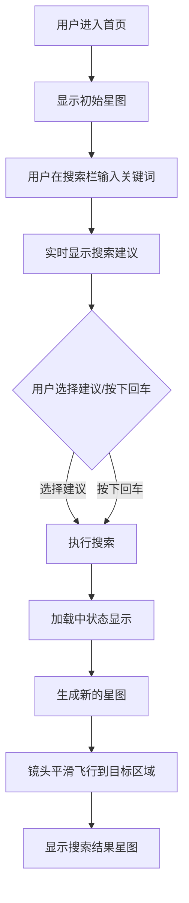
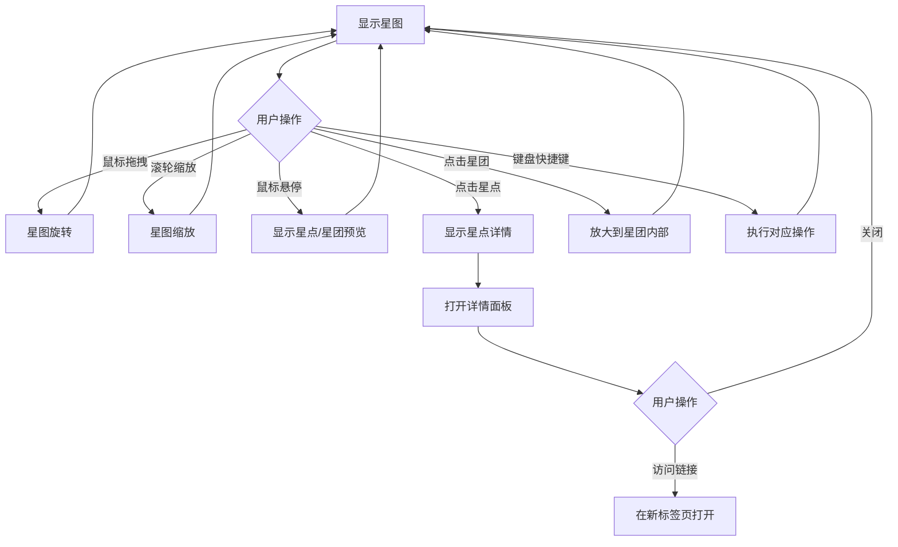
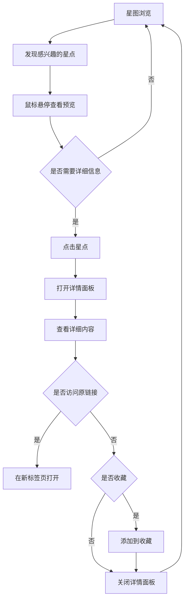

# SeekStar 前端交互设计方案

## 1. 整体界面布局

### 1.1 核心布局结构

SeekStar 采用沉浸式的 3D 星图界面，配合简洁的控制面板，打造无缝的用户体验。

```
┌───────────────────────────────────────────────────────────────────────────┐
│                              顶部导航栏                                     │
│  ┌─────────┐  ┌───────────────────────────────────┐  ┌─────────────┐       │
│  │  Logo   │  │         搜索栏                    │  │ 用户菜单     │       │
│  └─────────┘  └───────────────────────────────────┘  └─────────────┘       │
└───────────────────────────────────────────────────────────────────────────┘
┌───────────────────────────────────────────────────────────────────────────┐
│                              3D 星图主区域                                  │
│                                                                           │
│                                                                           │
│                                                                           │
│                                                                           │
│                                                                           │
│                                                                           │
│                                                                           │
└───────────────────────────────────────────────────────────────────────────┘
┌───────────────────────────────────────────────────────────────────────────┐
│                              底部信息栏                                     │
│  ┌─────────────────────────────────────────────────────────────────────┐   │
│  │  当前视图信息  │  统计数据  │  操作提示  │  状态栏                    │   │
│  └─────────────────────────────────────────────────────────────────────┘   │
└───────────────────────────────────────────────────────────────────────────┘
┌───────────────────────────────────────────────────────────────────────────┐
│                              右侧控制面板                                   │
│  ┌─────────────────────────────────────────────────────────────────────┐   │
│  │  星图设置  │  过滤选项  │  视图控制  │  分享按钮                     │   │
│  └─────────────────────────────────────────────────────────────────────┘   │
└───────────────────────────────────────────────────────────────────────────┘
```

### 1.2 界面组件说明

| 组件 | 位置 | 功能 |
|------|------|------|
| Logo | 顶部导航栏左侧 | 品牌标识，点击返回首页 |
| 搜索栏 | 顶部导航栏中央 | 输入搜索词，触发星图生成 |
| 用户菜单 | 顶部导航栏右侧 | 用户登录、注册、设置入口 |
| 3D 星图主区域 | 中央区域 | 展示星图，实现主要交互 |
| 底部信息栏 | 底部 | 显示当前视图信息、统计数据、操作提示 |
| 右侧控制面板 | 右侧 | 星图设置、过滤选项、视图控制、分享功能 |

## 2. 主要交互流程

### 2.1 搜索流程



### 2.2 星图交互流程



### 2.3 信息浏览流程



## 3. 3D 星图交互设计

### 3.1 基本交互控制

| 操作方式 | 效果 | 说明 |
|----------|------|------|
| 鼠标左键拖拽 | 星图旋转 | 围绕星图中心旋转视角 |
| 鼠标右键拖拽 | 星图平移 | 平移星图视图 |
| 鼠标滚轮 | 星图缩放 | 放大/缩小星图，靠近/远离星点 |
| 触控单指拖拽 | 星图旋转 | 移动端旋转视角 |
| 触控双指缩放 | 星图缩放 | 移动端放大/缩小 |
| 触控双指拖拽 | 星图平移 | 移动端平移视图 |

### 3.2 高级交互功能

#### 3.2.1 镜头飞行

- **触发方式**：搜索结果加载完成、点击星团、使用导航菜单
- **效果**：镜头平滑地从当前位置飞行到目标位置
- **参数**：
  - 飞行速度：可调节（默认中等速度）
  - 飞行路径：自动计算最优路径
  - 过渡效果：加速-匀速-减速

#### 3.2.2 星点选择

- **悬停效果**：
  - 星点高亮显示
  - 显示简要信息（标题、来源）
  - 相关星点连线临时显示

- **点击效果**：
  - 星点放大并突出显示
  - 打开详情面板
  - 高亮显示所属星团

#### 3.2.3 星团交互

- **悬停效果**：
  - 星团边界高亮
  - 显示星团名称和星点数量

- **点击效果**：
  - 镜头放大到星团内部
  - 星团内星点展开显示
  - 显示星团详情

### 3.3 视觉反馈设计

- **星点状态**：
  - 正常状态：半透明，根据亮度和大小区分重要性
  - 悬停状态：高亮，不透明，轻微放大
  - 选中状态：明显放大，高亮边框，持续发光效果
  - 相关状态：与选中星点有连线显示

- **星团状态**：
  - 正常状态：半透明边界，显示名称
  - 悬停状态：高亮边界，不透明度增加
  - 选中状态：高亮边框，内部星点开始旋转动画

- **加载状态**：
  - 星图生成中：显示加载动画和进度提示
  - 数据加载中：星点渐显效果
  - 操作反馈：点击时有轻微的视觉震动

## 4. 搜索与导航设计

### 4.1 搜索栏设计

- **位置**：顶部导航栏中央，占据主要宽度
- **外观**：
  - 简洁的圆角矩形设计
  - 占位符文字："搜索关键词或主题..."
  - 左侧搜索图标，右侧清除按钮
- **功能**：
  - 实时搜索建议：根据输入内容动态显示相关建议
  - 搜索历史：显示最近搜索记录
  - 语音搜索支持：点击麦克风图标进行语音输入
  - 搜索过滤：支持按数据源、语言、内容类型过滤

### 4.2 搜索建议交互

- **显示时机**：用户输入2个字符以上，或停顿0.5秒后
- **建议内容**：
  - 相关关键词
  - 热门搜索
  - 历史搜索记录
  - 语义扩展建议
- **交互方式**：
  - 鼠标悬停：高亮显示，显示简要说明
  - 点击：执行搜索
  - 键盘导航：支持上下箭头选择，回车确认

### 4.3 导航系统

#### 4.3.1 星图导航

- **全局视图**：显示整个星图的概览
- **区域导航**：快速跳转到不同主题区域
- **历史导航**：前进/后退按钮，支持浏览历史记录
- **收藏导航**：快速访问收藏的星点和星团

#### 4.3.2 键盘快捷键

| 快捷键 | 功能 |
|--------|------|
| Ctrl/Cmd + F | 聚焦搜索栏 |
| Ctrl/Cmd + +/- | 放大/缩小 |
| 空格键 | 重置视图 |
| 方向键 | 平移视图 |
| Enter | 执行搜索 |
| Esc | 关闭面板/取消操作 |
| F | 切换全屏模式 |
| S | 保存当前星图 |
| H | 显示/隐藏帮助 |

## 5. 信息展示设计

### 5.1 详情面板

- **触发方式**：点击星点或星团
- **位置**：右侧滑出面板（默认）或底部滑出面板（移动端）
- **内容结构**：
  - 顶部：标题、来源、发布日期
  - 中部：内容摘要、作者、标签
  - 底部：操作按钮（访问链接、收藏、分享）
- **交互方式**：
  - 滑动浏览长内容
  - 点击标签可进行相关搜索
  - 支持复制内容

### 5.2 预览卡片

- **触发方式**：鼠标悬停在星点上
- **位置**：悬停位置附近，智能避开边界
- **内容**：
  - 标题
  - 来源
  - 简要描述
  - 相关性分数
- **特点**：
  - 半透明背景，轻微阴影
  - 快速显示和隐藏，无延迟
  - 自适应内容长度

### 5.3 统计信息

- **位置**：底部信息栏
- **内容**：
  - 当前视图星点数量
  - 星团数量
  - 搜索词
  - 视图坐标信息
- **交互**：
  - 点击可显示详细统计面板
  - 支持复制统计数据

## 6. 用户设置设计

### 6.1 设置面板

- **入口**：用户菜单 > 设置
- **内容分类**：
  - **视觉设置**：主题、星点密度、颜色方案
  - **交互设置**：灵敏度、飞行速度、操作方式
  - **数据设置**：默认数据源、语言偏好
  - **隐私设置**：历史记录、数据收集
  - **快捷键设置**：自定义快捷键

### 6.2 个性化主题

- **默认主题**：深色主题（星空模式）
- **可选主题**：
  - 浅色主题：适合白天使用
  - 多彩主题：更丰富的星点颜色
  - 极简主题：减少视觉干扰
- **自动切换**：根据系统时间自动切换主题

### 6.3 星图显示选项

- **星点密度**：低/中/高，可调节
- **标签显示**：显示/隐藏星团标签
- **连线显示**：显示/隐藏星点间连线
- **LOD 级别**：自动/高性能/高质量

## 7. 响应式设计

### 7.1 桌面端（> 1200px）

- 完整功能展示
- 右侧控制面板常驻
- 详情面板右侧滑出
- 支持多窗口操作

### 7.2 平板端（768px - 1200px）

- 简化控制面板
- 详情面板底部滑出
- 搜索栏宽度自适应
- 触摸操作优化

### 7.3 移动端（< 768px）

- 沉浸式全屏体验
- 顶部导航栏可折叠
- 底部控制面板
- 简化交互，专注核心功能
- 优化触摸操作

## 8. 性能优化设计

### 8.1 渲染优化

- **LOD 技术**：根据距离动态调整星点细节
- **视锥体剔除**：只渲染可见区域的星点
- **批量渲染**：使用 Three.js InstancedMesh 优化大量星点渲染
- **Web Workers**：将复杂计算移至后台线程

### 8.2 数据加载优化

- **分页加载**：根据视图范围动态加载星点数据
- **预加载**：预测用户行为，提前加载可能需要的数据
- **缓存机制**：缓存已生成的星图数据
- **渐进式加载**：先显示低精度星图，再逐步提升细节

### 8.3 交互优化

- **防抖处理**：搜索输入、缩放等操作添加防抖
- **节流处理**：拖拽、滚动等高频操作添加节流
- **平滑过渡**：所有状态变化添加平滑过渡动画
- **硬件加速**：充分利用 GPU 加速渲染

## 9. 无障碍设计

### 9.1 键盘导航支持

- 所有功能可通过键盘访问
- 清晰的键盘焦点指示
- 支持屏幕阅读器

### 9.2 视觉辅助

- 高对比度模式支持
- 可调节的字体大小
- 颜色盲友好的配色方案
- 清晰的视觉层次

### 9.3 操作辅助

- 详细的操作提示
- 可调节的交互灵敏度
- 错误提示和恢复机制

## 10. 动画与过渡效果

### 10.1 核心动画

- **星图生成动画**：星点从中心向外扩散，形成星图
- **镜头飞行动画**：平滑的视角过渡，模拟太空飞行
- **星点高亮动画**：悬停时的脉冲效果
- **星团展开动画**：点击星团时的缩放效果

### 10.2 过渡效果

- **面板滑入滑出**：详情面板、设置面板的平滑过渡
- **搜索结果过渡**：新搜索结果的淡入效果
- **状态变化过渡**：按钮、图标状态变化的平滑过渡
- **加载过渡**：加载状态的优雅过渡

### 10.3 微交互

- **搜索栏焦点效果**：聚焦时的轻微放大和阴影变化
- **按钮点击反馈**：点击时的涟漪效果
- **星点选中效果**：选中时的发光和放大动画
- **滚动指示器**：平滑的滚动提示

## 11. 原型设计规范

### 11.1 设计系统

- **色彩方案**：
  - 主色调：深蓝色 #1a237e（代表星空）
  - 辅助色：紫色 #7b1fa2（代表神秘感）
  - 强调色：亮蓝色 #03a9f4（代表科技感）
  - 中性色：深灰 #333333，浅灰 #f5f5f5

- **字体**：
  - 标题：Roboto Slab（ serif 字体，增强科技感）
  - 正文：Roboto（ sans-serif 字体，提高可读性）
  - 代码：Consolas（等宽字体）

- **图标**：
  - 使用 Material Icons 图标库
  - 统一的填充风格
  - 一致的大小和间距

### 11.2 组件库

建立统一的组件库，包括：
- 按钮组件
- 输入组件
- 面板组件
- 导航组件
- 图表组件
- 加载组件

## 12. 测试与优化

### 12.1 用户测试

- **可用性测试**：邀请目标用户测试核心功能
- **A/B 测试**：对比不同设计方案的效果
- ** heuristic evaluation**：专家评审，基于交互设计原则

### 12.2 性能测试

- **帧率测试**：确保在不同设备上保持流畅的 60fps
- **加载时间测试**：优化首屏加载时间
- **内存占用测试**：监控内存使用，避免内存泄漏
- **兼容性测试**：测试主流浏览器和设备

### 12.3 持续优化

- 收集用户反馈
- 分析用户行为数据
- 定期更新设计方案
- 跟进最新的交互设计趋势

## 13. 未来扩展设计

### 13.1 社交功能

- 星图分享功能
- 协作编辑星图
- 跟随其他用户探索
- 社区推荐星图

### 13.2 AR/VR 支持

- 支持 AR 模式，将星图叠加到现实环境
- VR 沉浸式体验，完全置身于星图中
- 空间交互，支持手势控制

### 13.3 个性化推荐

- 基于用户行为的星图推荐
- 智能星点发现
- 个性化星图生成

### 13.4 多平台支持

- 桌面应用（Electron）
- 移动应用（React Native）
- 平板应用优化
- 智能电视应用

---

# 版本历史

| 版本 | 日期 | 作者 | 说明 |
|------|------|------|------|
| v1.0 | 2025-12-29 | SeekStar Team | 初始前端交互设计方案 |
