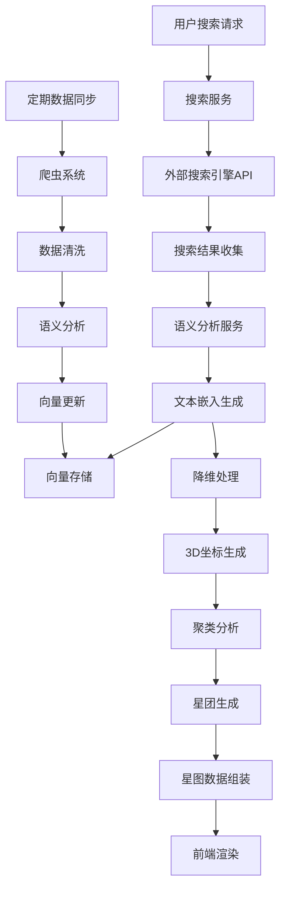

# SeekStar 技术架构设计

## 1. 整体架构概述

SeekStar 采用前后端分离的微服务架构，结合AI驱动的数据处理和3D可视化技术，实现互联网信息的星图化展示。

```
┌───────────────────────────────────────────────────────────────────────────┐
│                            前端应用层                                      │
│  ┌─────────────┐  ┌─────────────┐  ┌─────────────┐  ┌─────────────┐       │
│  │  3D 星图渲染 │  │  交互控制系统 │  │  搜索输入处理 │  │  数据可视化   │       │
│  └─────────────┘  └─────────────┘  └─────────────┘  └─────────────┘       │
│                  ↑                 ↑                 ↑                     │
└──────────────────┼─────────────────┼─────────────────┼─────────────────────┘
                   │                 │                 │
┌──────────────────┼─────────────────┼─────────────────┼─────────────────────┐
│                            API 网关层                                      │
│  ┌─────────────┐  ┌─────────────┐  ┌─────────────┐  ┌─────────────┐       │
│  │  认证授权   │  │  限流熔断   │  │  请求路由   │  │  负载均衡   │       │
│  └─────────────┘  └─────────────┘  └─────────────┘  └─────────────┘       │
│                  ↑                 ↑                 ↑                     │
└──────────────────┼─────────────────┼─────────────────┼─────────────────────┘
                   │                 │                 │
┌──────────────────┼─────────────────┼─────────────────┼─────────────────────┐
│                            后端服务层                                      │
│  ┌─────────────┐  ┌─────────────┐  ┌─────────────┐  ┌─────────────┐       │
│  │  搜索服务   │  │  星图生成服务 │  │  语义分析服务 │  │  数据同步服务 │       │
│  └─────────────┘  └─────────────┘  └─────────────┘  └─────────────┘       │
│                  ↑                 ↑                 ↑                     │
└──────────────────┼─────────────────┼─────────────────┼─────────────────────┘
                   │                 │                 │
┌──────────────────┼─────────────────┼─────────────────┼─────────────────────┐
│                            数据层                                          │
│  ┌─────────────┐  ┌─────────────┐  ┌─────────────┐  ┌─────────────┐       │
│  │  向量数据库 │  │  图数据库    │  │  关系数据库  │  │  对象存储    │       │
│  └─────────────┘  └─────────────┘  └─────────────┘  └─────────────┘       │
│                  ↑                 ↑                 ↑                     │
└──────────────────┼─────────────────┼─────────────────┼─────────────────────┘
                   │                 │                 │
┌──────────────────┼─────────────────┼─────────────────┼─────────────────────┐
│                            外部数据源                                      │
│  ┌─────────────┐  ┌─────────────┐  ┌─────────────┐  ┌─────────────┐       │
│  │  搜索引擎API │  │  开放数据API  │  │  爬虫系统    │  │  用户输入数据  │       │
│  └─────────────┘  └─────────────┘  └─────────────┘  └─────────────┘       │
└───────────────────────────────────────────────────────────────────────────┘
```

## 2. 技术栈选型

### 2.1 前端技术栈

| 技术/框架 | 用途 | 版本 |
|----------|------|------|
| Three.js | 3D 星图渲染 | ^0.160.0 |
| React | 前端框架 | ^18.2.0 |
| TypeScript | 类型安全 | ^5.3.0 |
| D3.js | 数据可视化辅助 | ^7.8.5 |
| Zustand | 状态管理 | ^4.4.7 |
| Tailwind CSS | 样式框架 | ^3.4.0 |

### 2.2 后端技术栈

| 技术/框架 | 用途 | 版本 |
|----------|------|------|
| Node.js | 运行时环境 | ^20.10.0 |
| NestJS | 后端框架 | ^10.3.0 |
| Python | AI 算法处理 | ^3.11.0 |
| FastAPI | AI 服务 API | ^0.104.0 |
| Redis | 缓存服务 | ^7.2.0 |
| Kafka | 消息队列 | ^3.6.0 |

### 2.3 数据库技术

| 数据库 | 用途 | 版本 |
|--------|------|------|
| Pinecone | 向量数据库 | - |
| Neo4j | 图数据库 | ^5.12.0 |
| PostgreSQL | 关系数据库 | ^15.0 |
| MinIO | 对象存储 | ^2023.11.0 |

### 2.4 AI 技术栈

| 技术/框架 | 用途 | 版本 |
|----------|------|------|
| LangChain | LLM 应用框架 | ^0.1.0 |
| SentenceTransformers | 文本嵌入 | ^2.2.2 |
| scikit-learn | 机器学习算法 | ^1.3.0 |
| UMAP | 降维算法 | ^0.5.4 |
| t-SNE | 降维算法 | ^0.4.1 |

## 3. 核心组件设计

### 3.1 前端核心组件

#### 3.1.1 3D 星图渲染引擎

- **功能**：负责将向量数据转换为3D星图，实现平滑的缩放、旋转和漫游效果
- **技术实现**：
  - 使用 Three.js WebGLRenderer 进行高性能渲染
  - 采用分层渲染策略，优化大量星点的显示
  - 实现LOD（细节层次）技术，根据距离动态调整星点密度

#### 3.1.2 交互控制系统

- **功能**：处理用户输入，实现星图的交互操作
- **主要功能点**：
  - 鼠标/触摸控制：旋转、缩放、平移
  - 键盘快捷键支持
  - 镜头动画效果：平滑过渡、飞行路径
  - 星点选择与信息展示

#### 3.1.3 搜索输入处理

- **功能**：处理用户搜索请求，转换为星图导航指令
- **技术实现**：
  - 实时搜索建议
  - 搜索历史记录
  - 语义扩展：自动生成相关关键词

### 3.2 后端核心服务

#### 3.2.1 搜索服务

- **功能**：整合多种数据源，提供统一的搜索接口
- **技术实现**：
  - 调用外部搜索引擎API（如Google、Bing）
  - 结合内部知识库进行增强
  - 实现搜索结果的去重和排序

#### 3.2.2 星图生成服务

- **功能**：将搜索结果转换为3D星图数据
- **技术实现**：
  - 调用语义分析服务获取向量表示
  - 应用降维算法（UMAP/t-SNE）生成3D坐标
  - 进行聚类分析，形成星团结构
  - 计算星点之间的关联强度，生成连线

#### 3.2.3 语义分析服务

- **功能**：对文本内容进行语义理解和向量转换
- **技术实现**：
  - 使用预训练模型（如BERT、GPT）进行文本嵌入
  - 实现文本分类和主题提取
  - 计算内容之间的语义相似度

#### 3.2.4 数据同步服务

- **功能**：定期从外部数据源同步数据，更新内部知识库
- **技术实现**：
  - 分布式爬虫系统
  - 增量更新机制
  - 数据质量监控和清洗

## 4. 数据处理流程



## 5. 核心算法设计

### 5.1 语义嵌入算法

- **目标**：将文本内容转换为高维向量表示
- **实现**：
  - 采用 SentenceTransformers 库的预训练模型
  - 支持多语言文本处理
  - 实现向量的归一化和优化

### 5.2 降维算法

- **目标**：将高维向量转换为3D空间坐标
- **实现**：
  - 主要使用 UMAP 算法（兼顾性能和质量）
  - 备用 t-SNE 算法（用于高质量静态星图）
  - 实现降维参数的动态调整

### 5.3 聚类算法

- **目标**：将相似的星点聚合成星团
- **实现**：
  - 采用 HDBSCAN 算法（层次密度聚类）
  - 支持不同密度的星团检测
  - 实现星团的层级结构生成

### 5.4 星图布局算法

- **目标**：生成美观且有意义的星图布局
- **实现**：
  - 基于力导向算法调整星点位置
  - 考虑星团之间的关联关系
  - 优化视觉层次感和可读性

## 6. 系统性能优化

### 6.1 前端性能优化

- **星点渲染优化**：
  - 使用 InstancedMesh 批量渲染星点
  - 实现星点的动态加载和卸载
  - 采用 Web Workers 处理复杂计算

- **内存管理**：
  - 实现星图数据的高效序列化
  - 定期清理不再使用的资源
  - 优化状态管理，减少不必要的重渲染

### 6.2 后端性能优化

- **服务缓存**：
  - 使用 Redis 缓存频繁访问的搜索结果
  - 实现缓存的自动过期和更新机制

- **异步处理**：
  - 使用 Kafka 处理异步任务
  - 实现请求的异步响应模式

- **负载均衡**：
  - 采用 Nginx 进行请求分发
  - 实现服务的自动扩缩容

## 7. 安全性设计

### 7.1 前端安全

- 实现 CSP（内容安全策略）
- 防止 XSS 和 CSRF 攻击
- 敏感数据加密传输

### 7.2 后端安全

- 实现 JWT 认证机制
- API 接口限流和熔断
- 数据加密存储
- 定期安全审计和漏洞扫描

### 7.3 数据隐私

- 遵循 GDPR 和其他数据保护法规
- 实现用户数据的匿名化处理
- 提供数据删除和导出功能

## 8. 部署架构

### 8.1 开发环境

- 使用 Docker Compose 部署本地开发环境
- 支持热重载和实时调试

### 8.2 测试环境

- 实现 CI/CD 流水线
- 自动化测试和性能监控
- 多环境配置管理

### 8.3 生产环境

- 基于 Kubernetes 的容器化部署
- 实现高可用和容错机制
- 分布式日志和监控系统

## 9. 监控与维护

- 实现全链路监控
- 关键指标告警
- 日志聚合和分析
- 定期性能测试和优化

## 10. 未来扩展方向

- 支持更多数据源和内容类型
- 实现实时星图更新
- 支持用户自定义星图
- 增强AI驱动的内容推荐
- 支持多设备同步和协作

---

# 版本历史

| 版本 | 日期 | 作者 | 说明 |
|------|------|------|------|
| v1.0 | 2025-12-29 | SeekStar Team | 初始架构设计 |
